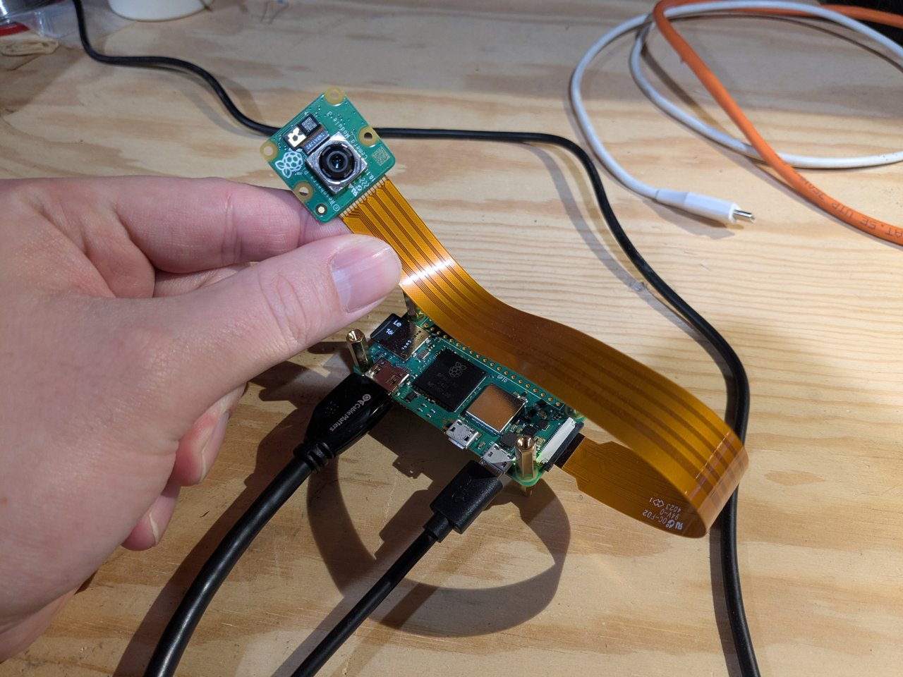
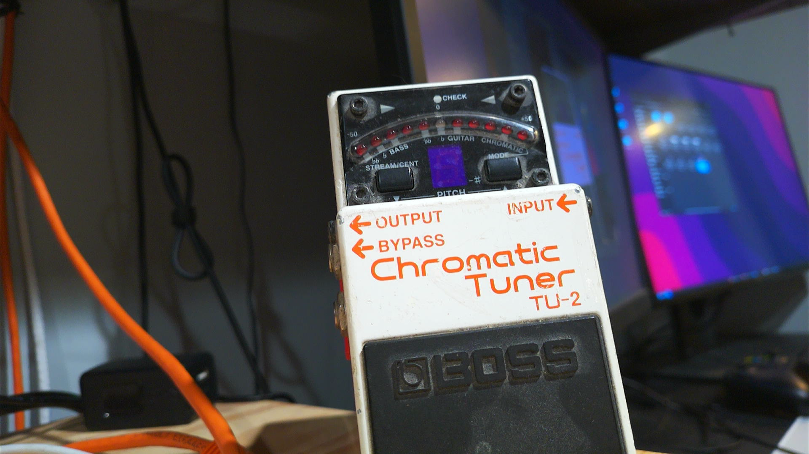

<p align="center">
	
	
</p>

# HDMI Cam

## Overview

This project turns a Raspberry Pi Zero 2 W into a webcam by combining it with an HDMI capture device.

My goal with this project was to make a webcam capable of 1920x1080 at 30 fps that would be compatible with most streaming and video conferencing software.

### Why not use uvc-gadget?

The [uvc-gadget](https://gitlab.freedesktop.org/camera/uvc-gadget) project and its forks make use of the [Linux UVC Gadget driver](https://docs.kernel.org/usb/gadget_uvc.html) to provide a class compliant USB video device. This is a pretty straightforward way to turn a Pi with USB OTG into a USB webcam.
 
The problem is that the uvc-gadget project and the Linux UVC Gadget driver only support the UVC 1.1 specification (at least as of 2025-01). This means that we are limited to raw (YUYV422) or MJPEG video streams, no H264. Raw video streams at resolutions at or above 720p 30 fps are not suitable for the relatively low bandwidth (~300 Mbit real world max) USB 2.0 bus on the Pi Zero 2 W. MJPEG streams can easily push 1080p 60 fps over USB 2.0, and this is what most webcams do. My Pi Zero 2 W immediately jumps to 65°C and climbing when encoding an MJPEG stream, and that might be fine but it made me uncomfortable. I don't want to sacrifice the compact nature of Zero 2 by adding cooling, and this could be running for hours at a time.

### Why not make it an ip camera?

Using [raspicam-vid](https://www.raspberrypi.com/documentation/computers/camera_software.html#rpicam-vid) you could easily output a UDP or HTTP stream that would be suitable for many purposes. However, not all software that accepts video input can grab a network stream. Pretty much everything understands a UVC device like my HDMI capture dongle.

## Software

[Raspberry Pi OS Lite 64 bit (Bookworm)](https://www.raspberrypi.com/software/operating-systems/)

## Hardware

- [Raspberry Pi Zero 2 W](https://www.raspberrypi.com/products/raspberry-pi-zero-2-w/)
- [Raspberry Pi Camera Module 3](https://www.raspberrypi.com/products/camera-module-3/)
- Mini HDMI to HDMI cable
- HDMI USB Capture dongle ([This](https://www.amazon.com/gp/product/B0974MJY14) one worked for me)

## Cost Of Hardware (2025-01)

- $15 Raspberry Pi Zero 2 W
- $25 Raspberry Pi Camera Module 3
- $16 HDMI Capture dongle
- <$10 Mini HDMI to HDMI cable
- <$10 USB power brick and cable

Total: $56 - $76

## Installation

Install Picamera2 ([documentation](https://datasheets.raspberrypi.com/camera/picamera2-manual.pdf)):

```
sudo apt install python3-picamera2
```

Copy hdmi_cam.service to /home/pi/.config/systemd/user/

Copy hdmi_cam.sh and hdmi_cam_ctl.py to /home/pi/bin

Make the scripts executable:

```
chmod u+x /home/pi/bin/hdmi_cam.sh
chmod u+x /home/pi/bin/hdmi_cam_ctl.py
```

Enable and start the service:

```
systemctl --user enable hdmi_cam.service
systemctl --user start hdmi_cam.service
```

Run `raspi-config` and under `System Options -> Boot / Auto Login` choose `Console Autologin`